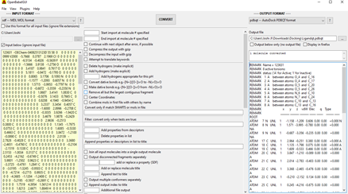
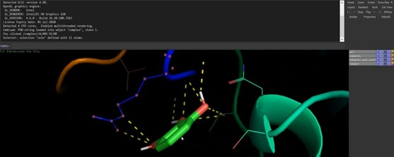

# Binding_And_Beyond_Docking_Molecular_study_on_EGFR_mutations_in_lung_cancer- 

## ⚠️ Usage Notice

This project is created for my academic and portfolio purposes.

You are free to refer to this work, but: 
- Direct copying or submission as your own work is strictly discouraged 
- Unauthorized use without attribution will be considered academic misconduct. 

## 📄 License
This project is licensed under the CC BY-NC 4.0 License.

## Binding & Beyond: Molecular Docking of Gefitinib with EGFR

## 🧬 Project Overview
This project focuses on studying the interaction between Epidermal Growth Factor Receptor (EGFR) and the anticancer drug Gefitinib using molecular docking.

EGFR plays a critical role in non-small cell lung cancer (NSCLC). Mutations in EGFR alter drug binding efficiency, making it essential to study ligand-receptor interactions computationally.

Molecular docking was performed using PyRx, and visualization was carried out using PyMOL and Chimera.

---

## 🎯 Objectives

- Retrieve EGFR protein structures (wild-type and mutant)
- Prepare receptor and ligand structures
- Perform molecular docking using PyRx
- Analyze binding affinity and RMSD
- Visualize ligand-receptor interactions
- Compare wild-type and mutant EGFR binding

---

## 🛠️ Tools & Software Used

- Protein Data Bank (PDB)
- PubChem
- PyRx (AutoDock Vina)
- AutoDock Tools
- Open Babel 
- PyMOL

---

## ⚙️ Methodology

### 1. Receptor Preparation
- Downloaded EGFR structures from PDB
- Removed water molecules and unwanted chains

  
- Added hydrogen atoms
  

- Converted to `.pdbqt` format

    

### 2. Ligand Preparation
- Downloaded Gefitinib from PubChem

- Converted SDF → PDB → PDBQT
- Energy minimization performed

### 3. Docking (PyRx) 
- Loaded receptor and ligand

 

- Defined grid box around active site 
- Performed docking using AutoDock Vina 

### 4. Analysis
- Selected best pose (Mode 0)
- Evaluated:
  - Binding affinity (kcal/mol)
  - RMSD values
- Visualized interactions using PyMOL

---

## 📊 Results

| Receptor | Binding Affinity (kcal/mol) | Key Residues |
|----------|----------------------------|-------------|
| Wild-type EGFR | -5.8 | Met793, Leu718, Lys745 |
| Mutant EGFR | -6.5 | Met793, Leu858, Thr790 |

### Key Observations
- Mutant EGFR shows stronger binding with Gefitinib
- Lower binding energy indicates higher stability
- Critical residues involved in binding were identified

---

## 🧪 Visualization

### Best Docked Pose (Mutant)
 

### Color Coding for Clarity:
To differentiate interaction types:
- Hydrogen bonds → yellow dashed lines
-	Hydrophobic residues → green or grey surface
-	Aromatic/π-interactions → magenta sticks 

---

## 📁 Project Structure 
EGFR-Gefitinib-Docking/
│
├── README.md
├── docs/
├── figures/
├── results/
├── data/ 

---

## 📌 Key Learnings

- Molecular docking helps predict drug-protein interactions
- EGFR mutations significantly impact drug binding
- Visualization tools are essential for interpreting docking results

---

## 📚 References

- Protein Data Bank (PDB)
- PubChem Database
- AutoDock Vina Documentation

---

## 👩‍🔬 Author

Yukta Joshi  
Bioinformatics | Computational Biology | AI in Healthcare 

🙏 Acknowledgment

Data provided by PDB And PubChem database. 

⭐ If you like this project, give it a star!! 

