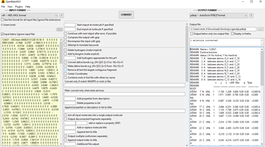
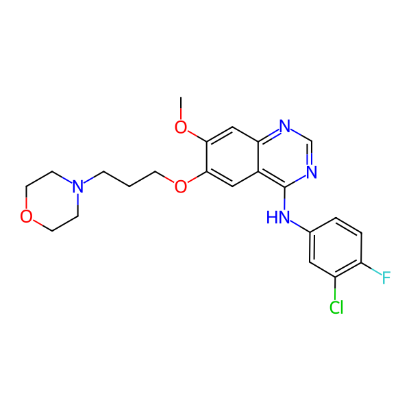
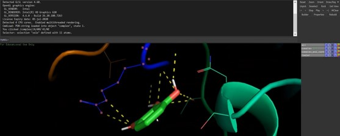
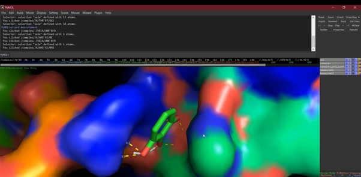

# Binding And Beyond Docking Molecular study on EGFR mutations in lung cancer-  

## 📄 License 
This repository has been created for academic and portfolio purposes. Commercial use is not permitted.  
The project report, documentation, figures, and other original content are licensed under the **Creative Commons Attribution–NonCommercial 4.0 International (CC BY-NC 4.0)** License. 

See the [LICENSE](LICENSE) file for the complete license terms.

--- 

## Binding & Beyond: Molecular Docking of Gefitinib with EGFR

## 🧬 Project Overview
This project focuses on studying the interaction between Epidermal Growth Factor Receptor (EGFR) and the anticancer drug Gefitinib using molecular docking.

EGFR plays a critical role in non-small cell lung cancer (NSCLC). Mutations in EGFR alter drug binding efficiency, making it essential to study ligand-receptor interactions computationally.

Molecular docking was performed using PyRx, and visualization was carried out using PyMOL and Chimera. 

--- 

## 🎯 Objectives

- Retrieve EGFR protein structures (wild-type and mutant)
- Prepare receptor and ligand structures
- Perform molecular docking using PyRx
- Analyze binding affinity and RMSD
- Visualize ligand-receptor interactions
- Compare wild-type and mutant EGFR binding

---

## 🛠️ Tools & Software Used

- Protein Data Bank (PDB)
- PubChem
- RDKit
- Python
- VS Codes  
- PyRx (AutoDock Vina)
- AutoDock Tools
- Open Babel 
- PyMOL 

---

## Project Repository Structure 

''' 
📁  Binding_And_Beyond_Docking_Molecular_study_on_EGFR_mutations_in_lung_cancer
│
├── 📄 README.md
├── 📄 LICENSE
│
├── 📘 Project_Report_BI.pdf
├── 📑 Methodology.md
├── 📊 results-summary.md
├── 🧪 Lung_Cancer_Molecular_Docking.pdf
│
├── 📁 RDKit
│   │
│   ├── 📘 Gefitinib_RDKit.ipynb
│   │      └── Complete RDKit workflow:
│   │          - SDF file loading
│   │          - Molecular descriptor calculation
│   │          - Lipinski Rule of Five
│   │          - Morgan fingerprint generation
│   │          - CSV export
│   │          - 2D structure generation
│   │
│   ├── 📁 data
│   │   └── 🧬 Gefitinib.sdf
│   │          └── PubChem ligand input file
│   │
│   ├── 🧾 Gefitinib_Descriptors.csv
│   │          └── RDKit calculated molecular properties
│   │
│   └── 📁 Output
│       └── 🖼️ Gefitinib_2D.png
│              └── RDKit generated 2D molecular structure
│
├── 🖼️ Open_Babel.png
├── 🖼️ PyMOL.jpg
└── 🖼️ PyMOL_Surface_Level.jpg 

''' 
--- 

## ⚙️ Methodology

### 1. Receptor Preparation
- Downloaded EGFR structures from PDB
- Removed water molecules and unwanted chains

  
- Added hydrogen atoms
  

- Converted to `.pdbqt` format

    

### 2. Ligand Preparation
- Downloaded Gefitinib from PubChem

- Converted SDF → PDB → PDBQT
- Energy minimization performed 

### 3. Molecular Descriptor Analysis (RDKit)

The Gefitinib ligand structure was retrieved from PubChem in **SDF format** and analyzed using **RDKit**, an open-source cheminformatics library.

The molecule was loaded using RDKit's `Chem.SDMolSupplier()` function, followed by molecular descriptor calculation, drug-likeness evaluation, molecular fingerprint generation, and 2D structure visualization.

📘 [RDKit Analysis Notebook](RDKit/Gefitnib_RDKit.ipynb)  

### RDKit Molecular Descriptor Calculation

The following molecular descriptors were calculated:

- Molecular Weight
- LogP (Lipophilicity)
- Topological Polar Surface Area (TPSA)
- Hydrogen Bond Donors (HBD)
- Hydrogen Bond Acceptors (HBA)
- Rotatable Bonds
- Ring Count
- Heavy Atom Count
- Fraction Csp3

### RDKit Descriptor Results

| Descriptor | Value |
|------------|-------|
| Molecular Weight (Da) | 446.91 |
| LogP | 4.28 |
| TPSA (Ų) | 68.74 |
| Hydrogen Bond Donors | 1 |
| Hydrogen Bond Acceptors | 7 |
| Rotatable Bonds | 8 |
| Ring Count | 4 |
| Heavy Atom Count | 31 |
| Fraction Csp3 | 0.36 |

The complete descriptor output generated using RDKit is available:

📄 [Gefitinib_Descriptors.csv](RDKit/Gefitinib_Descriptors.csv)

### Lipinski's Rule of Five Assessment

The calculated descriptors were evaluated using Lipinski's Rule of Five:

| Parameter | Gefitinib Value | Rule | Result |
|-----------|----------------|------|--------|
| Molecular Weight | 446.91 Da | < 500 Da | Pass |
| LogP | 4.28 | < 5 | Pass |
| H-Bond Donors | 1 | ≤ 5 | Pass |
| H-Bond Acceptors | 7 | ≤ 10 | Pass |

Gefitinib satisfies all Lipinski criteria, indicating favorable drug-like properties.

### Molecular Fingerprint Generation

Morgan fingerprints were generated using RDKit to represent the molecular structure as a binary fingerprint vector.

The fingerprint representation can be used for:
- Molecular similarity analysis
- Chemical clustering
- Machine learning applications

### 2D Molecular Structure Visualization

The 2D structure of Gefitinib was generated using RDKit and saved as an image.

 

The generated RDKit 2D structure image is available here: [Gefitinib_2D.png](RDKit/Output/Gefitinib_2D.png) 

### 4. Docking (PyRx) 
- Loaded receptor and ligand

 

- Defined grid box around active site
  
 
  
- Performed docking using AutoDock Vina 

### 5. Analysis
- Selected best pose (Mode 0)
- Evaluated:
  - Binding affinity (kcal/mol)
  - RMSD values
- Visualized interactions using PyMOL 

---

## 📊 Results

| Receptor | Binding Affinity (kcal/mol) | Key Residues |
|----------|----------------------------|-------------|
| Wild-type EGFR | -5.8 | Met793, Leu718, Lys745 |
| Mutant EGFR | -6.5 | Met793, Leu858, Thr790 |

### Key Observations
- Mutant EGFR shows stronger binding with Gefitinib
- Lower binding energy indicates higher stability
- Critical residues involved in binding were identified

---

## 🧪 Visualization

### Best Docked Pose (Mutant) 

 

### Best Docked Pose (Wild) 

 

### Color Coding for Clarity:
To differentiate interaction types:
- Hydrogen bonds → yellow dashed lines
-	Hydrophobic residues → green or grey surface
-	Aromatic/π-interactions → magenta sticks 

---

## 🎥 Project Report 

A detailed Project Report showcasing Methodology and Results is available in this repository.

**📄 Project Report:** [View Project Report](Project_Report_BI%20.pdf) 

--- 

## 📌 Key Learnings

- Molecular docking helps predict drug-protein interactions
- EGFR mutations significantly impact drug binding
- Visualization tools are essential for interpreting docking results

---

## 📚 References

- Protein Data Bank (PDB)
- PubChem Database
- AutoDock Vina Documentation

---

## 👩‍🔬 Author

Yukta Joshi  
Bioinformatics | Computational Biology | AI in Healthcare 

🙏 Acknowledgment

Data provided by PDB And PubChem database. 

⭐ If you like this project, give it a star!!  

